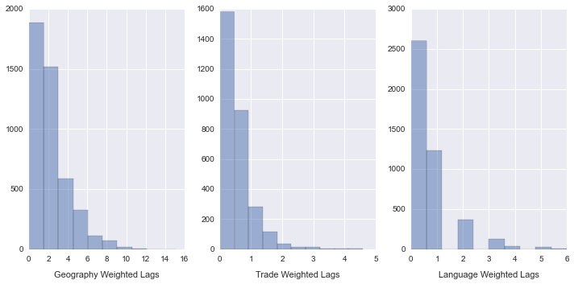

## Regime failure

This repository hosts several Python and R scripts for feature engineering, imputation, analysis, and visualization related to the analysis of authoritarian regime breakdown and democratic transition. The analysis is focused on the spillover effects of regime failures on future regime failures abroad, where the influence is captured by various operationalizations of *distance*, including geographic, linguistic, and economic distances between countries. 

The code in this repository uses [regime data from Geddes, Wright, and Frantz](http://dictators.la.psu.edu/ 'Autocratic Regimes') to construct spatiotemporal lags of regime failure. A demonstration of this process is in the [IPython Notebook titled `space_time_lags.ipynb`](https://github.com/thomasbrawner/regime_failure/blob/master/space_time_lags.ipynb). Missing data are imputed with the [Amelia II library in R](http://gking.harvard.edu/amelia 'Amelia II: A Program for Missing Data'). Programs for carrying out the analysis are located in the Python file [`dissertation.py`](https://github.com/thomasbrawner/regime_failure/blob/master/dissertation.py'), which formats the imputed data sets for analysis, performs rolling cross-validation to optimize hyperparameters for the classifiers, and aggregates the performance of the models over imputations. 

