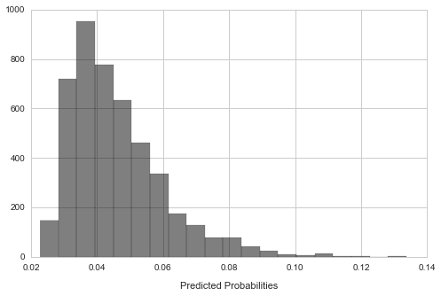
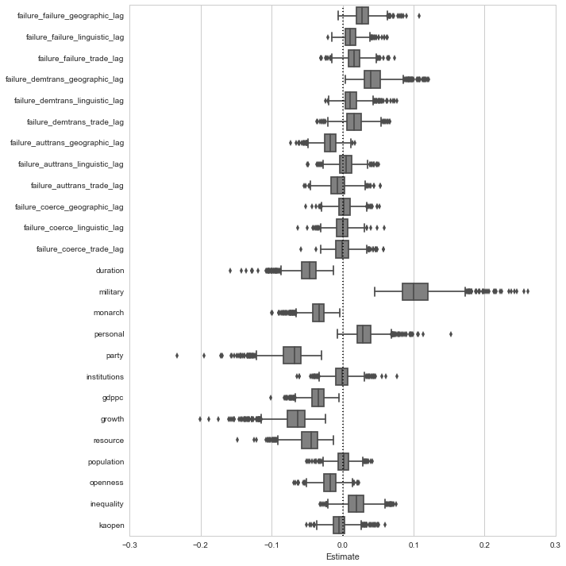

##Models of autocratic regime failure

This repository hosts several Python and R scripts for feature engineering, imputation, analysis, and visualization related to the analysis of authoritarian regime breakdown and democratic transition. The analysis is focused on the spillover effects of regime failures on future regime failures abroad, where the influence is captured by various operationalizations of distance, including geographic, linguistic, and economic distances between countries.

The code in this repository uses [regime data from Geddes, Wright, and Frantz](http://dictators.la.psu.edu/ 'Autocratic Regimes') to construct spatiotemporal lags of regime failure. A demonstration of the procedure to construct these lags is in the [IPython Notebook titled `space_time_lags.ipynb`](https://github.com/thomasbrawner/regime_failure/blob/master/wrangle/space_time_lags.ipynb). Missing data are imputed with the [Amelia II library in R](http://gking.harvard.edu/amelia 'Amelia II: A Program for Missing Data'). 

The main programs for carrying out the analysis are located in the Python file [`dissertation.py`](https://github.com/thomasbrawner/regime_failure/blob/master/model/dissertation.py), which formats the imputed data sets for analysis, performs 10-fold cross-validation on the training data to optimize hyperparameters for the classifiers, and aggregates the performance of the models over imputations. Once trained, we have the option to generate in-sample predicted probabilities in cross-validation (as below) or out-of-sample predicted probabilities for test data. 

To demonstrate the analysis, below I present a model of autocratic failure. In this example I use a logistic regression model with elastic net regularization, which we can get using the `SGDClassifier` in scikit-learn.

    classifier = SGDClassifier(loss='log', penalty='elasticnet')
    hyperparameters = {'alpha' : np.logspace(-3, 0, num=21), 'l1_ratio' : np.linspace(0, 1, num=11)}
    year_threshold = 2015
    specification = ['lags', 'regimes', 'controls', 'region', 'decade']

Read and format each of the imputed data sets, then evaluate the optimal parameterization for each of the imputed data sets. Because autocratic failures are relatively rare events, model performance is evaluated in terms of log loss instead of accuracy. 

    data_list = [prepare_data(file_path=make_file_path(i), dep_var='failure', spec=specification) for i in xrange(1, 11)]
    melder = diss.Melder(data_list, classifier, hyperparameters, year_threshold=year_threshold)
    melder.evaluate_models()

We can see the optimal level of regularization for each of these models.

    for i in xrange(len(data_list)):
        print(melder.model_evaluations[i].optimal_params)

    {'alpha': 0.12589254117941676, 'l1_ratio': 0.0}
    {'alpha': 0.17782794100389229, 'l1_ratio': 0.0}
    {'alpha': 0.25118864315095796, 'l1_ratio': 0.0}
    {'alpha': 0.25118864315095796, 'l1_ratio': 0.0}
    {'alpha': 0.25118864315095796, 'l1_ratio': 0.0}
    {'alpha': 0.3548133892335753, 'l1_ratio': 0.0}
    {'alpha': 0.25118864315095796, 'l1_ratio': 0.0}
    {'alpha': 0.25118864315095796, 'l1_ratio': 0.0}
    {'alpha': 0.25118864315095796, 'l1_ratio': 0.0}
    {'alpha': 0.17782794100389229, 'l1_ratio': 0.0}

Combine the predicted probabilities from the optimized models fit on each of the imputations and show the resulting distribution.

    melder.meld_predictions()
    predictions = melder.predictions
    plt.figure(figsize=(8,5))
    plt.hist(predictions, bins=20, alpha=0.5, color='k')
    plt.xlabel('Predicted Probabilities', labelpad=11); 

Finally, we can extract and visualize the coefficient estimates averaged across the models. The sampling distribution for the estimates is obtained by evaluating the model on 100 bootstrap samples drawn from each of the ten imputed data sets, resulting in 1000 estimates.

    melder.meld_estimates()
    estimates = melder.estimates

In place of a regression table with coefficient estimates and standard errors, I present these results with boxplots of the 1000 bootstrap estimates for each of the key variables in the model. Notably, I suppress the estimates for region and decade dummies.

    names = data_list[0].specification
    plt.figure(figsize=(10, 10))
    dp.boxplot_estimates(estimates, names, ignore=['decade_', 'region_'])

